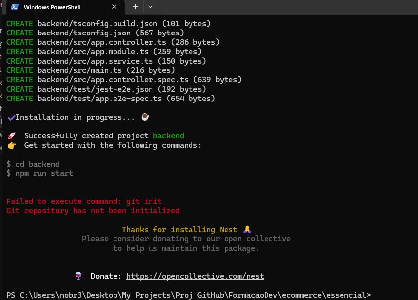

# ecommerce

## Aula 01

Rodar o projeto 

## Aula 02

### backend

será utilizado o nestjs: https://docs.nestjs.com/

Na pasta essencial rodar os comandos: 

'npm i -g @nestjs/cli'

'nest new backend'

